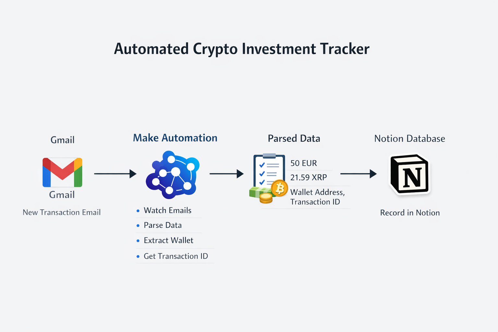

# CRYPTO INVESTMENT AUTOMATION

This project automatically tracks cryptocurrency purchases by parsing transaction emails and storing the data in a Notion database.

The system detects payment confirmation emails, extracts transaction data and logs it automatically.

# WORKFLOW

Gmail (transaction email)
      ↓
Make automation
      ↓
Regex parsing
      ↓
Notion database

-----
-----
-----

# DATA EXTRACTED

The automation extracts:

- Fiat amount (EUR)
- Cryptocurrency amount
- Crypto ticker (BTC, ETH, XRP…)
- Wallet address
- Transaction ID
- Purchase date

# EXAMPLE RECORD

| Asset | Fiat   | Amount        | Platform |
| ----- | ------ | ------------- | -------- |
| XRP   | 50 EUR | 21.596703 XRP | Mercuryo |

# TECNOLOGIES USED

Gmail API
Make (Integromat)
Notion API
Regex parsing
Automation workflows

# FEATURES

Automatic email detection
Regex-based transaction parsing
Automatic database logging
Crypto-agnostic (BTC, ETH, XRP, etc.)

# CONFIGURATION

Before using this blueprint in Make, replace or reconnect the following values:

- `YOUR_CONNECTION` → your Make connection for Gmail or Notion
- `YOUR_GMAIL_LABEL_ID` → your Gmail label ID
- `YOUR_NOTION_DATABASE_ID` → your Notion database ID
- `your_email@gmail.com` → your own email address